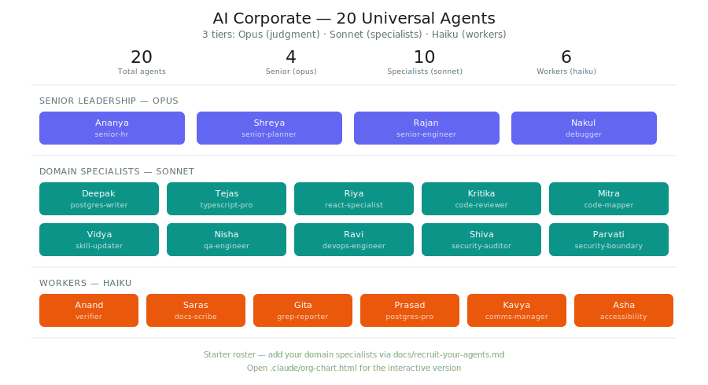
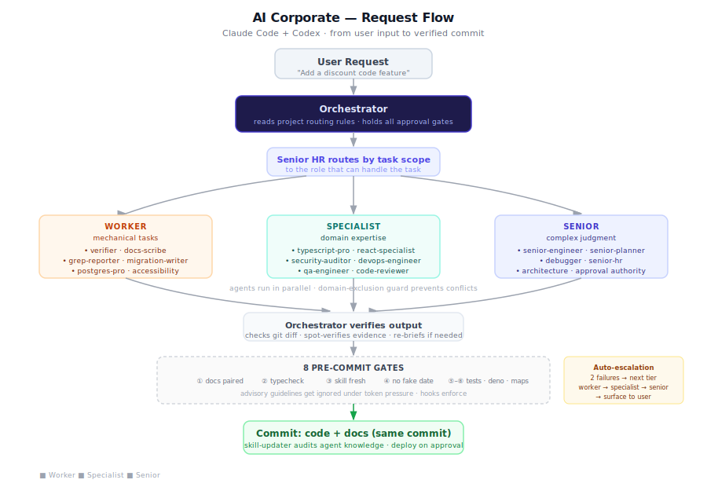

# AI Corporate

**Corporate governance for Claude Code and Codex.**

Run your AI agents like a company. Named employees, specialist routing, HR approval, disciplinary hooks, and cost-tier optimization.





---

## Why?

Multi-agent AI coding systems have a scaling problem. Once you move beyond a single assistant, you run into questions that software teams solved decades ago:

- **Who handles what?** Without routing rules, every agent tries to do everything — badly.
- **Who's allowed to touch what?** Without domain boundaries, two agents edit the same file and create merge conflicts or silent regressions.
- **How do you control cost?** Sending every task to your most capable (and most expensive) model wastes money on work a cheaper model handles fine.
- **How do you enforce standards?** Without pre-commit gates, agents skip documentation, ignore type errors, and bypass specialist knowledge.

AI Corporate treats these as organizational problems, not technical ones. It gives your agents job titles, reporting lines, domain ownership, and disciplinary enforcement — the same structures that make human engineering teams function.

This framework was battle-tested on a production ERP system with 47 AI agents across 3 model tiers before being extracted as a reusable package.

---

## Key Features

### Named Employee System

Every agent has a name, a role, and a model tier. No more `agent-1` or `helper-bot`. Each employee has a definition file specifying their capabilities, tools, and constraints.

```
agents/
  postgres-pro.md         # Priya (sonnet) — read-only DB specialist
  senior-engineer.md      # Vikram (opus) — cross-cutting architecture
  verifier.md             # Deepa (haiku) — build/test runner
  ...
```

Three tiers map to cost and capability:

| Tier | Role | When to use |
|------|------|-------------|
| **Opus** | Senior leadership | Judgment calls, architecture, approval authority |
| **Sonnet** | Specialists | Domain expertise, complex implementation |
| **Haiku** | Workers | Mechanical tasks, grep, verification, docs |

### Mandatory Specialist Routing

A routing table in `CLAUDE.md` maps triggers to the right specialist. The orchestrating agent must delegate — it cannot do the work inline.

```markdown
| Trigger                  | Agent              |
|--------------------------|--------------------|
| DB query / schema change | postgres-pro       |
| Complex TS errors        | typescript-pro     |
| Security audit           | security-auditor   |
| React re-renders         | react-specialist   |
```

This prevents the generalist agent from attempting work it lacks context for. A route-guard hook enforces it at runtime.

### 8 Pre-Commit Gates

A `.githooks/pre-commit` script runs 8 checks before any commit lands:

1. **Docs pairing** — code changes require matching documentation updates
2. **Typecheck** — staged TypeScript must pass the project's `tsc` config
3. **Skill freshness** — agent knowledge files must not have stale verification dates
4. **Date-only bump block** — prevents agents from faking skill verification by just updating a date
5. **Code-map pairing** — large files (1,500+ lines) must have a paired structural map
6. **Code-map anchor check** — structural anchors in maps must match actual source
7. **Edge function check** — Deno files must pass `deno check`
8. **Test gate** — enforced test coverage for changed modules

### Route-Guard Hook (v5 — hard deny, docs route too)

A `PreToolUse` hook intercepts file writes in real time — both `Edit`/`Write` tool calls AND shell writes (`sed -i`, redirects, `tee`, `cp`/`mv`, `Set-Content`, `git apply/checkout/restore`). If the orchestrator tries to write a specialist-domain source file, the hook **denies** the write and names the specialist to spawn.

Deny, not ask: an "ask" dialog gets habitually approved and the orchestrator learns nothing; a deny bounces the correction back to the model, which then spawns the specialist. This matters most on cheaper orchestrator tiers (Sonnet), where rule compliance decays fastest.

Genuine inline exceptions go through a **user-only override file** (`.claude/ROUTE_OVERRIDE`, one path per line, consumed one-shot) — the hook denies any in-session attempt to create or modify it, so only the human can grant the exception.

**v5 — docs route too.** The blanket "orchestrator may edit any `.md`" allowance is closed: `docs/**` routes to the docs worker, `.agents/skills/**` to the skill updater. Field observation: the "one-line doc edit is cheaper inline" carve-out got generalized into full multi-table doc rewrites by two different orchestrator models on the same day. Memory files and root `CLAUDE.md` remain orchestrator-editable.

### Brief-Guard Hook

A second `PreToolUse` hook validates every agent spawn prompt before it dispatches. The prompt must contain: the identity opener (`You are **Name** (role, model)`), the first-output identity instruction, a REPORT schema, a `Done =` stop condition, and — for write-capable agents — the destructive-git prohibition. Missing pieces are denied back to the orchestrator with the exact fix, and it re-spawns correctly — no user interruption.

### Anti-Decay Reinjection

A `UserPromptSubmit` hook re-injects the three load-bearing invariants (~50 tokens) on every user turn: route source edits to specialists, complete spawn briefs, prod changes need approval. Session-start rules decay from context by hour 2–3 on any model — just-in-time reinforcement beats a bigger rulebook at the top.

### Auto-Escalation

When an agent fails twice at a task, it automatically escalates to the next tier up:

```
haiku (fails) --> sonnet (fails) --> opus
```

Two strikes at a tier triggers mandatory escalation. This prevents cheap models from burning tokens on problems above their capability.

### Domain Exclusion

File-level locking prevents two agents from editing the same domain simultaneously. When an agent claims a file, other agents are blocked until the lock is released. A utility script handles manual lock clearing when needed.

### HR Recruitment

Adding a new agent to the workforce is not free. Every new employee proposal goes through an HR evaluation that checks:

- Does an existing agent already cover this domain?
- Is the proposed model tier the cheapest that can handle the work?
- Does the agent definition include clear boundaries and constraints?
- Is there a routing trigger that would actually invoke this agent?

This prevents agent sprawl — the tendency to create a new specialist for every minor sub-problem.

### Cost Optimization

The three-tier system is explicitly designed to minimize token spend:

- **Haiku** handles grep sweeps, build verification, log monitoring, docs updates — anything mechanical and well-specified.
- **Sonnet** handles domain-specific implementation where the agent needs real expertise.
- **Opus** handles judgment calls, architecture decisions, and cross-cutting refactors where getting it wrong is expensive.

In practice, this produces roughly 40-50% token savings compared to routing everything through the most capable model.

> **Stack with RTK for maximum savings.** [RTK (Rust Token Killer)](https://github.com/reachingforthejack/rtk) is a CLI proxy that sits at the Claude Code hook level and compresses tool outputs before they reach the model — independently of what agents write. Combine it with AI Corporate's agent output discipline (R1–R19, see `docs/agent-efficiency.md`) and you get savings from two separate layers: AI Corporate cuts agent *output* tokens by 50–65%; RTK cuts *tool output input* tokens by 60–90%. Together they typically reduce total session cost by 70–85% compared to an undisciplined all-Opus setup.

### Performance Tracking

A JSON-based performance log (`agent-performance-log.json`) records every subagent task — successes, failures, and violations. This enables:

- **Accountability:** Agents that ignore instructions or produce subpar output are logged with evidence.
- **HR routing:** Historical performance data informs which agent gets future tasks.
- **Capability audits:** Periodic reviews reveal agents that need retraining, tier changes, or retirement.

See **[Performance Tracking](docs/performance-tracking.md)** for the full system.

### Mid-Task Communication

Background agents can receive updated instructions via `SendMessage` while running. This is essential for correcting an agent's approach mid-task without killing and re-spawning. However, agents under token pressure may ignore mid-task corrections — the performance log catches this pattern.

### Delegation Brief Discipline

The orchestrator follows a strict protocol for writing delegation prompts. Brief anatomy: one-sentence task + acceptance condition, file paths and line ranges (never file contents), hard constraints only, fixed report schema. Agents receive the minimum context they need to do the work — not a knowledge dump of everything the orchestrator knows.

A standard report schema is embedded in every implementation brief, forcing agents to produce checkable `file:line` evidence instead of prose:

```
VERDICT: <fixed | blocked | needs-decision>
ROOT CAUSE: file:line + ≤2 sentences
CHANGES: bullet list, file per line
EVIDENCE: ≤10 lines of output diff
```

See **[Writing Delegation Briefs](docs/writing-delegation-briefs.md)** for the full brief anatomy, tier selection table, escalation handoff template, and trust signals for verifying subagent output.

### Agent Learning Methodology

Agents accumulate beliefs about the codebase across long sessions. Without discipline, these beliefs grow stale, get written into memory indiscriminately, or get silently swallowed mid-task when a discovery contradicts the brief.

AI Corporate defines a protocol for how agents should update their beliefs:

- **Surprise filter:** update only when the new information contradicts a prediction you would have made
- **Effect-level verification:** verify at the outcome, not at the claim — never trust a tool's self-report about its own gate
- **Retention threshold:** only write down what a competent engineer cannot rediscover in under a minute
- **Worker 3-tier protocol:** Tier 1 (act + state update in report) · Tier 2 (put `LEARNED:` in report, let orchestrator retain) · Tier 3 (stop and escalate — never reconcile contradictions silently)

See **[Learning Methodology](docs/learning-methodology.md)** for the full protocol.

### Reasoning Discipline (Fable transfer)

Captured from Fable 5 (Anthropic's Mythos-class model) before its access window closed: nine problem-solving mechanics written as executable procedure — bet-before-look, cheapest discriminating test, invariant-first debugging, one-level-deeper causality, altitude control, reversible/irreversible split, negative-space check, pre-mortem, declared stop conditions — plus per-tier application and an honest map of where the discipline itself fails (compliance decay, non-transferable taste, doc drift).

Every agent definition carries its tier's slice: Opus seniors get the judgment mechanics, Sonnet specialists the debugging loop, Haiku workers surprise-reporting and schema-as-stop-condition.

See **[Reasoning Discipline](docs/reasoning-discipline.md)**.

### The Orchestrator Turn Loop

The moment-to-moment algorithm that strings the components together: classify every message before acting (question vs inline diff vs specialist route vs feature-scoping stop vs approval gate), then the dispatch beat (commit → brief with an in-head bet → fan-out in one block → "I'm free"), the integration beat (compare report to bet; a surprise means the brief was wrong), and the closeout beat (verify at the effect, docs in the same commit, negative-space pass).

Token thrift falls out of the loop: orchestrator context grows by ≤250-word reports instead of files, and the most expensive failure — acting past an unprocessed surprise — is structurally blocked.

See **[The Orchestrator Turn Loop](docs/orchestrator-turn-loop.md)** — includes verbatim mini-briefs at calibrated lengths.

### Installable Skills (`.claude/skills/`)

The `docs/` set is reading material; the skills are the load-on-demand form a live Claude Code session actually triggers on. Two ship with the framework:

- **[fable-orchestration](.claude/skills/fable-orchestration/SKILL.md)** — the whole orchestration discipline (turn loop, brief anatomy, tier selection, report schemas, escalation, reasoning mechanics, learning protocol) as one session-loadable skill. Copy it to `~/.claude/skills/` to get it in **every** project, or keep it per-repo.
- **[skill-library-bootstrap](.claude/skills/skill-library-bootstrap/SKILL.md)** — how to build a project's skill library so cheaper models can carry it: gap-analysis before authoring (the taxonomy is a menu, not a mandate), a ≤5-question discovery phase, ground-truth authoring rules, a 3-reviewer pipeline, and model-transfer evals. Sized honestly: greenfield repos get 3–5 skills, not 16.

Skills and docs share one-home-per-fact: docs hold depth, skills hold the operational form.

### Corporate Org Chart

An interactive HTML visualization (`org-chart.html`) renders the full workforce hierarchy — tiers, roles, domain ownership, and reporting lines. Useful for onboarding and for auditing agent coverage gaps.

---

## Further Cost Reduction — Stack with RTK

AI Corporate controls *agent output* tokens (what agents write back). [RTK](https://github.com/reachingforthejack/rtk) controls *tool output input* tokens (what CLI tools pipe into the model) — a completely separate cost layer that AI Corporate cannot touch.

Install RTK alongside this framework for an additional **60–90% reduction** on tool output tokens:

```bash
cargo install rtk
# Then run Claude Code — RTK rewrites git/grep/bash output transparently via hook
rtk gain   # see your savings
```

See `docs/agent-efficiency.md` for the full R1–R19 output discipline rules (the AI Corporate layer) and how both tools complement each other.

---

## Getting Started

### 1. Clone the repo

```bash
git clone https://github.com/your-org/ai-corporate.git
```

### 2. Copy the framework into your project

```bash
# Claude Code
cp -r ai-corporate/.claude/ your-project/.claude/
cp ai-corporate/CLAUDE.md your-project/CLAUDE.md

# Codex
cp -r ai-corporate/.codex/ your-project/.codex/
cp ai-corporate/AGENTS.md your-project/AGENTS.md

# Shared Git quality gates
cp -r ai-corporate/.githooks/ your-project/.githooks/
```

If the target already has `CLAUDE.md`, `AGENTS.md`, `.claude/`, or `.codex/`, merge the template deliberately rather than overwriting project-specific rules.

### 3. Configure git hooks

```bash
cd your-project
git config core.hooksPath .githooks
chmod +x .githooks/pre-commit
```

### 4. Customize agent definitions

For Claude Code, edit `.claude/agents/`. For Codex, edit `.codex/agents/`. Both packages provide named, scoped employee profiles; keep their responsibilities aligned with your project's domains.

- Name, role, and model tier
- Tools the agent is allowed to use
- Domain boundaries (what files/systems it owns)
- Constraints and safety gates

### 5. Update the routing table

Edit `CLAUDE.md` for Claude Code and `AGENTS.md` for Codex to map your project's file structure and domains to the appropriate specialists. The routing table is the core of the system — it determines which agent handles which trigger.

For Codex, open `/hooks` after copying `.codex/`, review the project-local hook definitions, trust them, then start a new task. Project hooks are skipped until trusted.

### 6. Configure pre-commit gates

Edit `.githooks/pre-commit` to enable or disable gates based on your project's needs. Not every project needs all 8 gates — start with docs pairing and typecheck, then add more as your agent workforce matures.

---

## How the System Works

AI Corporate operates on a **three-tier cost model** where every task is routed to the cheapest model that can handle it:

| Tier | Model | Output Cost | Role |
|------|-------|------------|------|
| **Opus** ($75/MTok output) | Senior leadership | 60x Haiku | Judgment, architecture, approvals |
| **Sonnet** ($15/MTok output) | Specialists | 12x Haiku | Domain expertise, implementation |
| **Haiku** ($1.25/MTok output) | Workers | Baseline | Verification, grep, docs, mechanical tasks |

This produces **40-50% token savings** compared to routing everything through the most capable model. The savings come from high-volume mechanical tasks (verification, docs, grep) running on Haiku at 1/60th the cost of Opus.

For the full operational methodology, see **[How It Works](docs/how-it-works.md)** -- covering parallel execution, the orchestrator pattern, agent lifecycle, and the pre-commit gate pipeline.

For detailed pricing, decision matrices, and anti-patterns, see **[Cost Model](docs/cost-model.md)**.

### Session Example: Parallel Execution Flow

When a user requests a new feature, the system executes in parallel rather than sequentially:

```
User: "Add an inventory report with API endpoint"

1. Orchestrator reads routing table, spawns Planner (opus)
2. Planner returns sub-tasks:
   - DB query (postgres specialist)
   - Report component (frontend specialist)
   - Edge function (edge-fn specialist)
   - Tests (QA engineer)
   - Docs (docs scribe)

3. Orchestrator spawns in parallel (all background):
   +-- Postgres specialist (sonnet) --> writes query
   +-- QA engineer (sonnet)         --> writes tests
   +-- Docs scribe (haiku)          --> prepares doc updates
   |
   (orchestrator stays free for other work)
   |
4. Sequential follow-ups (depend on DB output):
   +-- Frontend specialist (sonnet) --> builds component
   +-- Edge-fn specialist (sonnet)  --> implements endpoint

5. Orchestrator verifies: build + typecheck + tests + deno check
6. Commits code + docs together (pre-commit gates enforce pairing)
7. Deploys after user approval (safety gate)
8. Skill-updater audits agent knowledge (same commit)
```

The orchestrator never does specialist work inline. It coordinates, verifies, and holds all approval gates. Specialists report back; the orchestrator decides.

---

## Directory Structure

```
.claude/
  agents/                          # Employee definitions (one .md per agent)
    postgres-pro.md
    typescript-pro.md
    senior-engineer.md
    verifier.md
    ...
  hooks/
    route-guard.mjs                # Specialist routing enforcement
    clear-domain-locks.mjs         # Manual lock clearing utility
  memory/                          # Persistent memory across sessions
  org-chart.html                   # Interactive workforce visualization
  settings.json                    # Hook registration + permissions

.codex/
  agents/                          # Named Codex subagent profiles (.toml)
    corporate_architect.toml
    implementation_specialist.toml
    verifier.toml
    ...
  hooks/                           # Codex lifecycle context and routing reminders
  hooks.json                       # Codex hook registration
  config.toml                      # Project-level Codex agent settings

.githooks/
  pre-commit                       # 8-gate enforcement hook

CLAUDE.md                          # Master rules file
                                   #   - Routing table (trigger -> agent)
                                   #   - Pre-commit gate definitions
                                   #   - Safety policies
                                   #   - Cost-tier guidelines
AGENTS.md                          # Codex-native routing and safety guidance
```

---

## Battle-Tested Stats

This framework was extracted from a production deployment where it managed:

- **49 employees** across 3 model tiers
- **8 pre-commit gates** enforced on every commit
- **3 governance hooks** (route-guard, db-write-guard, read-skill-reminder)
- **247 enforced tests** gated by pre-commit
- **~40-50% token savings** vs. an all-opus approach
- **Performance log** tracking every agent task with violation accountability
- **13 deliverables** completed in the first full governance session

---

## Design Principles

**Agents are employees, not tools.** They have names, roles, boundaries, and accountability. This is not metaphorical — the naming and role structure changes how the orchestrator reasons about delegation.

**Enforce, don't advise.** Every rule that matters is hook-enforced. Advisory guidelines get ignored under token pressure. If a rule is worth having, it is worth blocking commits over.

**Cheapest capable tier.** Every task should run on the cheapest model that can handle it. Opus is for judgment, not for grep.

**Documentation is not optional.** Code changes without matching docs updates are rejected at pre-commit. Agents cannot skip this step.

**Specialists own domains.** A generalist agent that "knows a little about everything" produces worse results than a specialist that knows its domain deeply. The routing table makes this structural, not aspirational.

---

## Adapting to Your Project

AI Corporate is domain-agnostic. The framework provides the governance structure; you provide the domain knowledge. To adapt it:

1. **Define your domains.** What are the major areas of your codebase? Database, frontend, API, infrastructure, testing?

2. **Staff accordingly.** Create one specialist agent per domain. Start small — 5-10 agents is plenty for most projects. You can always recruit more through the HR process.

3. **Set your routing table.** Map file patterns and task triggers to specialists. Be specific: `*.sql` files go to the database specialist, `*.test.*` files go to the QA agent.

4. **Choose your gates.** Enable the pre-commit gates that match your workflow. Docs pairing and typecheck are good defaults.

5. **Tune cost tiers.** Assign haiku to anything mechanical (verification, formatting, grep). Promote to sonnet only when domain expertise is needed. Reserve opus for decisions that are expensive to reverse.

---

## Contributing

Contributions are welcome. If you have governance patterns that worked well in your multi-agent setup, open a PR.

Areas of particular interest:

- Additional pre-commit gates
- Alternative escalation strategies
- Cross-agent communication patterns
- Metrics and observability for agent performance

---

## License

MIT

---

## Credits

Built by [Karthik Nataraj](https://github.com/karthiknl0) for your project ERP, extracted as a reusable framework for governing AI coding agent workforces.
